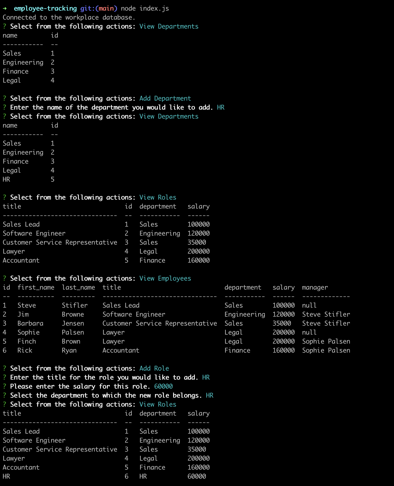
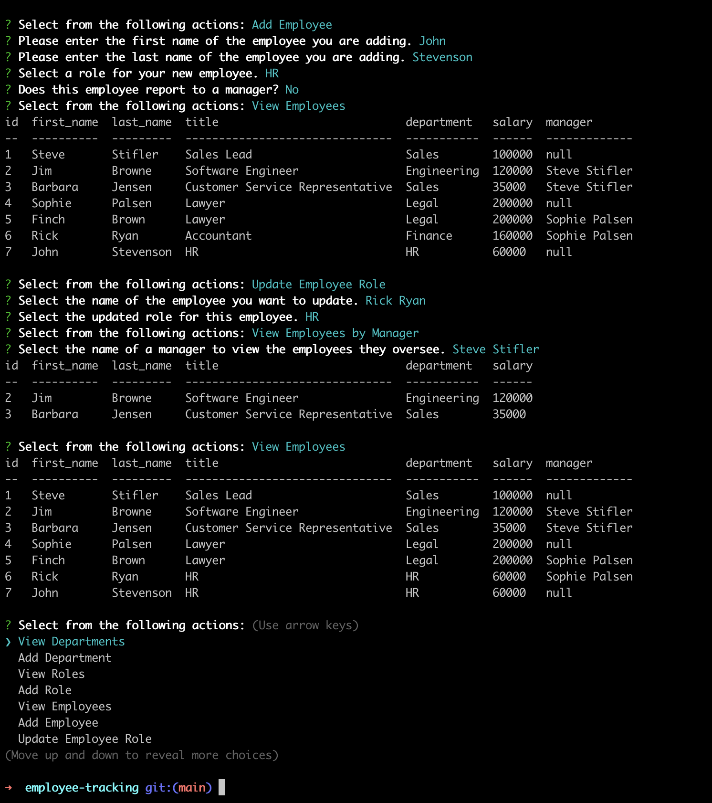

# Team Manager | Employee Tracker

## Description

EmployeeTracking is a CMS App that enables management of a company's employees database. The application will run from the `CLI`, and it is built with `Node.Js` and uses a `MySql` database.

## Table of Contents

- [Description](#description)
- [Demo](#demo)
- [License](#license)
- [Testing](#test)
- [Tech Stack](#technologies)
- [Feedback](#feedback)

 

## Demo

- [Watch the demo video!](https://drive.google.com/file/d/1KGy5CYsKVi600QLxEPw6lXjGM9SJCUH3/view)

### Start Screen:

 

### Running Demo:

 

## Test

    – To test and use the app on your local machine follow the instructions:
        • Clone the repository
        • Ensure you are in the project directory
        • Run "npm i" or "npm install" to install the required packages
        • Run "mysql -u root -p" and enter your credentials when/if prompted
        • Then run "source db/db.sql;"
        • Run "node index" or "node index.js" to start the app and follow the prompts

## License

This project is licensed under the MIT License.

## Technologies

    – Libraries:
        • dotenv
        • console.table
        • inquirer
        • mysql2

## Feedback

GitHub: [github.com/rfabreu](https://github.com/rfabreu)  
Comments, suggestions, questions? Contact me at: [rafael.gomes@mail.utoronto.ca](mailto:rafael.gomes@mail.utoronto.ca)  
See the App running: [Check it out!](https://drive.google.com/file/d/1KGy5CYsKVi600QLxEPw6lXjGM9SJCUH3/view)
